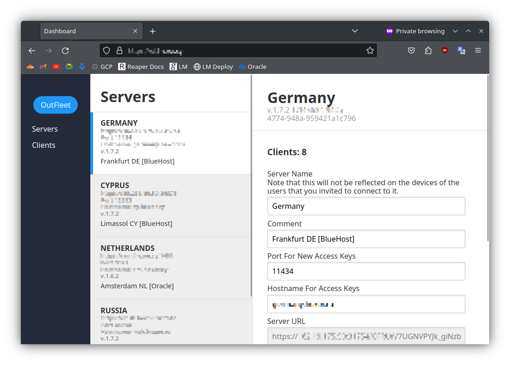

<p align="center">
  <h1 align="center">OutFleet: Master Your OutLine VPN</h1>

  <p align="center">
    Streamline OutLine VPN experience. OutFleet offers centralized key control for many servers and always-updated Dynamic Access Keys instead of ss:// links
    <br/>
    <br/>
    <a href="https://github.com/house-of-vanity/outfleet/issues">Request Feature</a>
  </p>
</p>

   

## About The Project



### Key Features

* Centralized Key Management
Administer user keys from one unified dashboard. Add, delete, and allocate users to specific servers effortlessly.

* 
Distribute ssconf:// links that are always up-to-date with your current server configurations. Eliminate the need for manual link updates.

### Why OutFleet?
Tired of juggling multiple home servers and the headache of individually managing users on each? OutFleet was born out of the frustration of not finding a suitable tool for efficiently managing a bunch of home servers. 

## Built With

Python, Flask and offer hassle-free deployment.

### Installation

Docker deploy is easy:
```
docker run --restart always -p 5000:5000 -d --name OutFleet --mount type=bind,source=/etc/outfleet/config.yaml,target=/app/config.yaml ultradesu/outfleet:latest
```
#### Use reverse proxy to secure ALL path of OutFleet except of `/dynamic/*`
```nginx
server {
  listen 443 ssl http2;
  server_name server.name;
  
  # Specify SSL config if using a shared one.
  #include conf.d/ssl/ssl.conf;
  
  # Allow large attachments
  client_max_body_size 128M;
    include /etc/letsencrypt/options-ssl-nginx.conf; # managed by Certbot
    ssl_dhparam /etc/letsencrypt/ssl-dhparams.pem; # managed by Certbot
    ssl_certificate /etc/letsencrypt/live/server.name/fullchain.pem; # managed by Certbot
    ssl_certificate_key /etc/letsencrypt/live/server.name/privkey.pem; # managed by Certbot

  location / {
    proxy_pass http://localhost:5000;
    proxy_set_header Host $host;
    proxy_set_header X-Real-IP $remote_addr;
    proxy_set_header X-Forwarded-For $proxy_add_x_forwarded_for;
    proxy_set_header X-Forwarded-Proto $scheme;
    auth_basic "Private Place";
    auth_basic_user_file /etc/nginx/htpasswd;
  }
  
  location /dynamic {
    auth_basic off;
    proxy_pass http://localhost:5000;
    proxy_set_header Host $host;
    proxy_set_header X-Real-IP $remote_addr;
    proxy_set_header X-Forwarded-For $proxy_add_x_forwarded_for;
    proxy_set_header X-Forwarded-Proto $scheme;
  }
    access_log /var/log/nginx/server.name.access.log;
    error_log /var/log/nginx/server.name.error.log;

}
server {
        listen 80;
        server_name server.name;
        listen [::]:80;
        return 301 https://$host$request_uri;
}

```
Keep in mind that all user keys are stored in a single **config.yaml** file. If this file is lost, user keys will remain on the servers, but OutFleet will lose the ability to manage them. Handle with extreme caution and use backups.

## Authors

* **UltraDesu** - *Humble amateur developer* - [UltraDesu](https://github.com/house-of-vanity) - *All the work*
